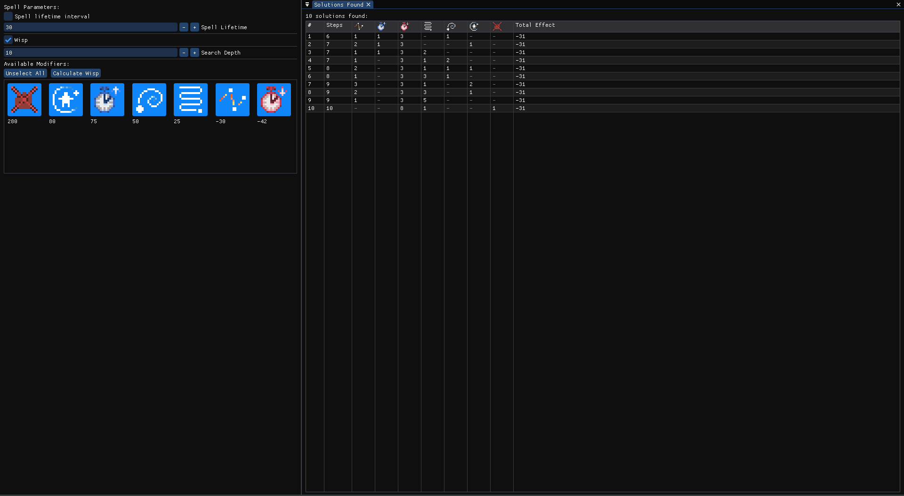

# Calculateur de Wisp pour Noita

Permet à partir de la durée de vie d'un sort et d'un ensemble de modifier de calculer facilement un [Wisp](https://noita.wiki.gg/wiki/Guide:_Infinite_Lifetime_Spells) pour Noita
C'est une reprise d'un de mes vieux code, à l'origine en Rust, je l'ai juste repris pour lui donner une interface sympa



## Fonctionnalité

- Calcule de wisp pour n'importe quel interval de lifetime de depart
- Target parametrable
- Modifier utilisé parametrable

## TODO

- Selection de lifetime via selection de sort (pour plus d'ergonomie)
- Selection du nombre de modifier (parametrage individuel)
- Multi-Icon pour les modifiers identique en pratique
- Prise en charge de proposition de build (calcule avec division-spell)
- Affichage du % de reussite du sort

## Dependance & Prérequis

Pensez à récupérer imgui-docking, inclus dans les sub-modules :

```bash
git submodule update --init --recursive
```

Assurez-vous d'avoir installé :

- **cmake**
- **g++** (compilateur C++)
- **GLFW** et **OpenGL** (bibliothèques graphiques)

### Installation rapide (Linux) :

```bash
sudo apt install g++ libglfw3 libglfw3-dev libglu1-mesa-dev  # Ubuntu/Debian
```

```bash
sudo dnf install gcc-c++ glfw glfw-devel mesa-libGLU-devel    # Fedora
```

```bash
sudo pacman -S gcc glfw-x11 glu                               # Arch
```

## Compilation

### Via CMake

```bash
cmake .
make
```

## Utilisation

./noitaWisp
